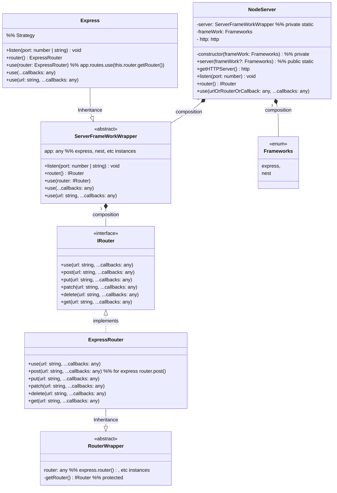

# Node server

### Package for creating framework agnostic node server

Requirements

-   Should be able to create on demand node server
-   Server can be created by different frameworks
-   Server should be able to listening user given port
-   Should be able to subscribe group of route
-   Should be able to subscribe middlewares on routes

## Usages

#### Install

```bash
npm install -s https://github.com/grootsinc/lib-node-server.git
```

#### Create server

```javascript

import { NodeServer, Frameworks, IRouter } from 'lib-node-server';


const nodeServer = new NodeServer(Frameworks.express)
nodeServer.listen(3000)

const router: IRouter = nodeServer.router() // a new router

router.post(url, function, function)

nodeServer.use(router)
```

## Class Diagram

[Mermaid live editor link](https://mermaid.live/edit#pako:eNrVVk2P2jAQ_SuWpZWgC5F6jdD2sKVqL90Vi7RVlYtxBrA2sSN7su0K9r938AcESrSoag_lgGL7zWTmvZdJNlyaEnjOZSWc-6jEyoq60FdXbPrt_m42Z2iYrBRgoT2CfaJz-GHsk2ObQjP6TSag2_rmJqzgZ2PBuVFYaXAU-Vro8ylT0plpEeyjFU0D9pBXLBxaITHlth6WM6FfGKWLt8rC9mA4YoCSKe1QaAkuxIxXgLMIYF_C1S64sQZBIpSxvFBIAuxLUJqWSyEh1XDdOhi0tsoZ1ab0asSyLJOiqhZCPjlf2zAiG-PwUmh7MVKgXF-ILaECvLRa4ultpKfqAewzWG-ERzJCkq3g7wvO3o3HexZzJk1NLChUZk9xT3Sv6HR8qvjI--qs3NeVcgh60BiLOSNfLij3NvY0ZM9GlRFoT0yx62wvcHJaPBt2jnoJvMgYnsBpaCOyNB5vb06eALqxXoNVvrNCJz4n2yxjx8E5U3VTQQ0aXWL4GLH5J77dqbE0NikSH83Mh_6Xpo6kBTV6PHoiyxHbbLOj5IGsi7B6-WMzHml3xpBH514FKi1MQJftgLhWaSJmndH3lx38lV4agaTOY9_L2tEUOBvaeaucwPvfRJ1E0eNj55d5XyV-7KtnUog6FKhkDFsmYN4pJJ6xNSINoN1_2In70tDgsa1EYwdn44ed20V-Q3kH-Iff8e2iUnJf3cHFn-fz-9AVmeRQzDmHvTHlukrf2bB7Z2-jzF7lHuH5iNdga6FK-l7wlBcc1zR7Cp7TZaVWayx4ALZNSX1PS0X88HwpKgcjLlo0Dy9a8pyYgwSKHx17VCP0d2PS-vUXBG_sgQ)


